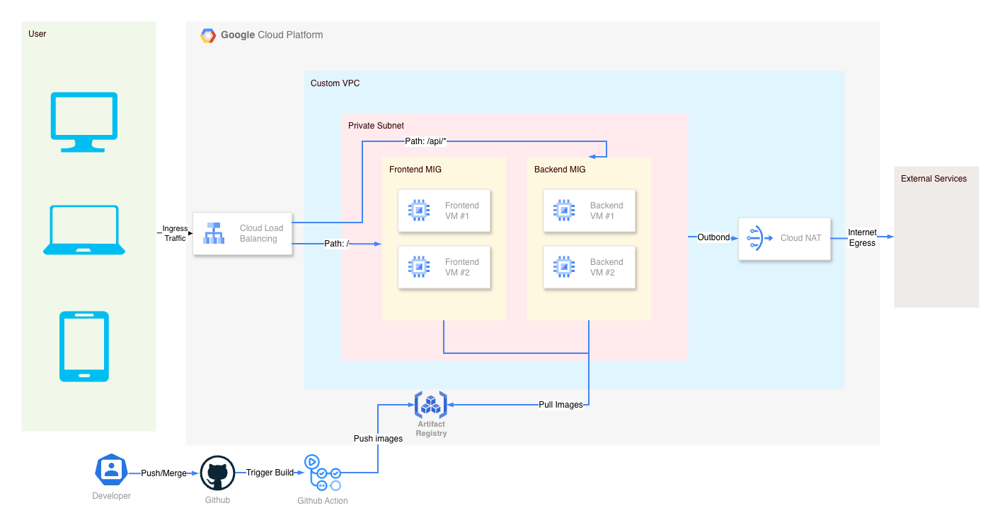
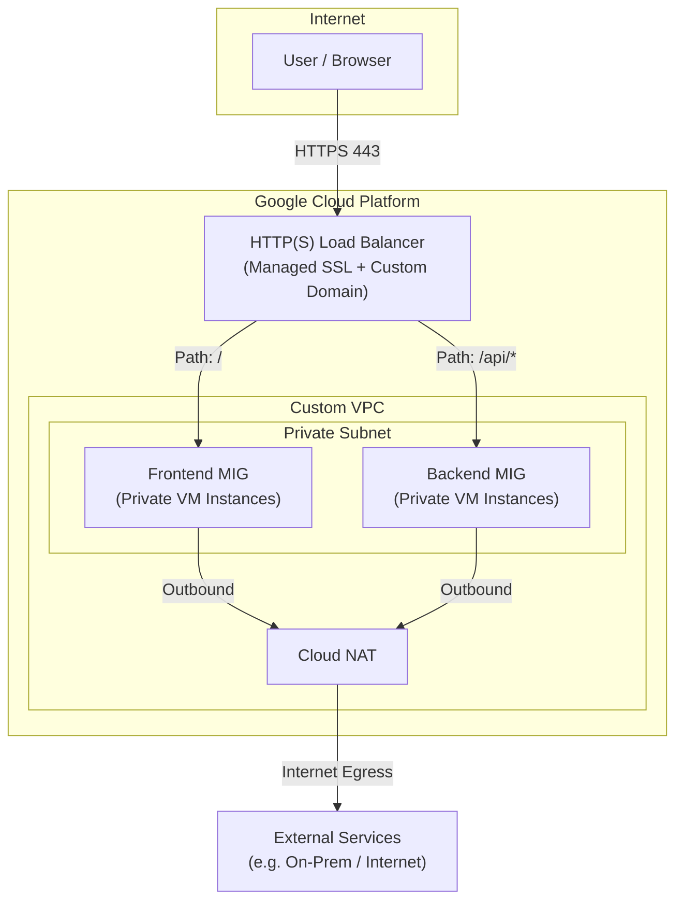

# Decommoir

# Decommoir — GCP Cloud & DevOps Project

Decommoir is a cloud-native infrastructure project deployed on Google Cloud Platform as part of the GCP Cloud & DevOps Lab. This project focuses on designing and operating production-oriented cloud infrastructure using managed services, Infrastructure as Code, and DevOps best practices.

This infrastructure project is derived from and supports the Decommoir application, which is developed separately and available at:
https://github.com/patuyyy/decommoir

Decommoir is a team-based IoT platform designed to support sustainable food waste management for the *Makan Bergizi Gratis (MBG)* program, integrating IoT devices and backend services. In this repository, the application serves as a real-world use case to explore cloud-native deployment, networking, and operational workflows on GCP.

The emphasis of this project is on cloud infrastructure, automation, and reliability rather than application-level feature development.

---

## ☁️ GCP Architecture Overview

The infrastructure is designed around private compute resources, managed ingress, and declarative infrastructure provisioning.

### Key Principles
- Private workloads (no public IPs on VMs)
- Single public entry point via HTTPS Load Balancer
- Infrastructure as Code (Terraform)
- Immutable infrastructure with Managed Instance Groups
- Automated deployments via CI/CD

---

## 🗺️ Architecture Diagram (GCP)

## 🧱 Infrastructure Components
### Networking
- Custom VPC
- Private subnet for all workloads
- Cloud NAT for outbound internet access
- Firewall rules following least privilege

### Compute
- Managed Instance Groups (MIG)
- Auto-healing via health checks
- Rolling updates
- VM instances treated as disposable
- Instance Templates as immutable blueprints

### Load Balancing
- Single Google HTTP(S) Load Balancer
- Path-based routing
- SSL termination using Google-managed certificates
- Custom domain mapped to load balancer IP (decommoir.online)

## 🧱 Infrastructure as Code

All infrastructure is provisioned and managed using Terraform:
- Reproducible deployments
- Incremental changes
- Clear separation between desired state and runtime resources
- No manual server configuration

## 🔁 CI/CD & Automation

- GitHub Actions used for continuous integration
- Automated container image builds
- Images pushed to Artifact Registry
- Deployments performed via Terraform-triggered rolling updates in MIGs

## 🎯 Learning Focus

This lab is designed to strengthen understanding of:
- Cloud-native networking and security boundaries
- Managed compute and scalability concepts
- Infrastructure automation with Terraform
- Immutable infrastructure and rolling deployments
- Operational differences between cloud-managed and self-hosted environments